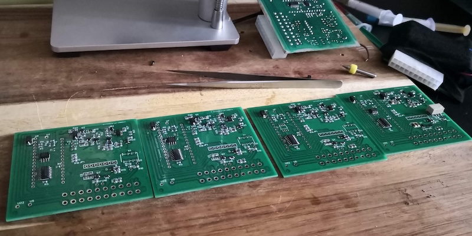
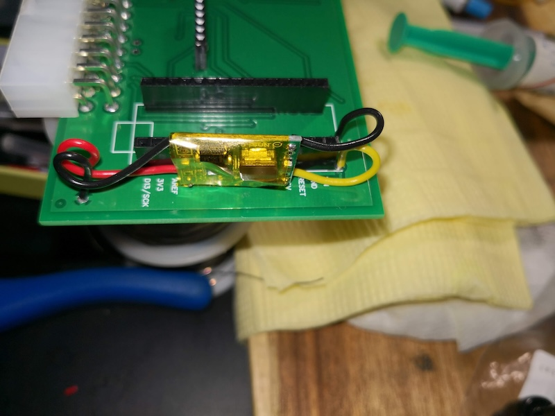
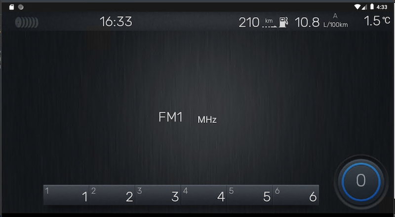
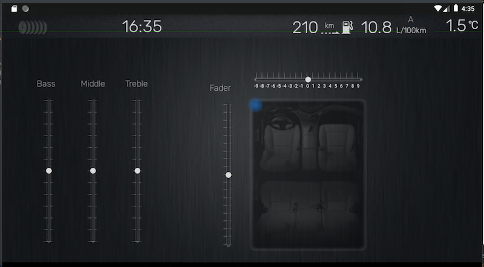
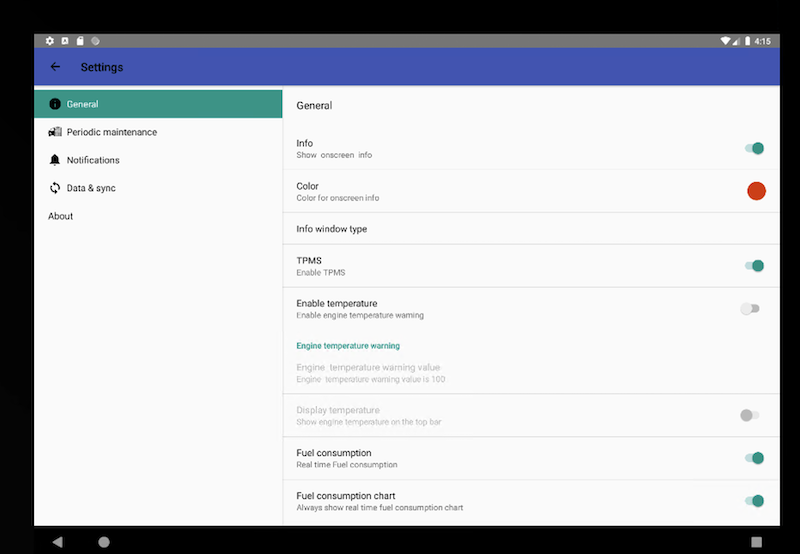

# PCB

 All Schematic and pcb can be found :  
 https://oshwlab.com/rasskazoff/subarulan  
 https://easyeda.com/editor#project_id=b3d2a45b2d0842fa9b5bcca11755af1b

### Schematic  
Subaru Tribeca Head unit uses a subset of the IEBus Standard, which was developed by NEC electronics for automotive use.

The avclan protocol decoder handles decoding IEBus frames which are used in the multimedia control AVC-LAN protocol.  It handles communications between Audio Head Units, CD Changers, Amplifiers, Switches, Navigation and so on.  
In my variant ,I build  schematic using   LM339 comparator + PCA82C251T and  ATMega328P  (Arduino) 

  
  
For powering  arduino  uses DC-DC Multi-output Buck Converter 7.5V~30V input to 5V output   (U5 & U22 points :input 12v & GND->  U6 point +5V & U7 GND )
  
  

CAN and LAN parts  
LAN - PCA82C251T (u1) + LM339D (u2)  
  
MCP2515 module  
  

Illumination (Brightness) part for   switches unit  
  

Stereo to mono (uses only in  navigation  or BT incoming  call)  
  

TPMS  (Tire pressure monitor signal )  

Connection points for Navi & MFD  versions
  

Connector   for Audio Head unit https://www.te.com/usa-en/product-174047-2.html  
  

# Developing environment:

## Arduino:  
This project was developed using Visual Studio Micro, but it can be easily adapted for Arduino IDE or PlatformIO. Certain sections of the code include commented blocks that aided me in reverse engineering CAN & LAN protocols. I've retained these comments because they contain valuable information that can be decoded, particularly related to the HVAC unit.

The primary objective for Arduino is to emulate Subaru media devices (SAT, CD changer, RSA, as well as MFA or Color monitor unit), communicate with Audio Head Units, and interact with the main body unit using the CAN Protocol.

The firmware does not decode LAN messages in real-time (except for check messages). Car units send sync messages to verify that all devices are online via CAN and LAN. If a device doesn't respond, units cease sending messages to the offline device. The decoding part is integrated into an Android application.

Dependency Library :  
//  https://www.arduino.cc/reference/en/libraries/qlist/  
//  https://github.com/mpflaga/Arduino-MemoryFree  
//  https://github.com/coryjfowler/MCP_CAN_lib  

### Structure
 - Tribeca3.ino: Main entry point
 - Lan: IEBus 
 - LanNAVI: LAN protocol communications 
 - CANDevice: CAN protocol communications
 - Android: Android communications

## Android

Android Studio Arctic Fox | 2020.3.1 Patch 2  
Runtime version: 11.0.10

The application is designed as a universal application and capable of running on tablets. However, for full integration into the car environment and Android unit OS, specific integrations tailored.
Supported platforms  : RK3399 (PX6). MCU : STM 32 with system namespace  com.hzbhd.**   and    Allwinner T3  K2001   namespace com.nwd.**  .There is no guarantee that the Android unit manufacturer will release new OS firmware, and updates may result in the loss of certain functionalities. Full integration often requires reverse engineering, as changes in the OS firmware can impact the application's compatibility!  
In such cases, reverse engineering becomes essential to understand the modifications made by manufacturers and to make necessary adjustments for seamless integration with the updated firmware.
Some manufacturers may implement specific optimizations or behaviors on their Android devices. These can include custom memory management strategies. Details about manufacturer-specific behaviors would be specific to each manufacturer and their modifications to the Android OS, that why Android application  has  com.hzbhd.***** (or com.nwd.** for nwd platform) namespaces. OS  (Android for auto unit) thinks that package is the system package(pre-installed system apps) and  allow to skip unload app from memory (clean memory process).  

To develop the application for PX6 and NWD units, the process involves obtaining firmware images. Start by acquiring firmware images specific to each platform. Unpacking these images requires special programs, readily available on platforms like XDA forums (Android auto unit = tablet plus  specific components such as radio and sound amplifier parts).

Once the images are unpacked, inspect the structure to locate the main system applications. Typically, the primary application consists of several background services that manage sound inputs, outputs, and Bluetooth functionalities. Identify the main service and proceed to decompile it to access its codebase. This step involves reverse engineering to understand the Intents used within the system and determine the parameters that can be sent with those Intents.

Additionally, ensure that the device's OS allows switching into Developer mode. This mode is essential for activities such as sniffing Intents and debugging the application, providing valuable insights during the development and integration process.

## Details:  

### Autostart

Not all models allow to auto run  custom application after run (or on the WakeUp).  

Need to  find  what intents  system sends to run system applications (like TPMS app, sound control app).  Using this information we can run auto run  the  application.
(details in StartServiceBroadcastReceiver)  
Sample  
 PX6  system uses:

- `<action android:name="android.intent.action.BOOT_COMPLETED_standy"  />`  

- `<action android:name="com.device.accon" />`  

- `<action android:name="com.device.poweroff" />`  

- `<action android:name="com.device.poweron" />`  

NWD system uses other intents:

- `<action android:name="com.nwd.action.ACTION_MCU_STATE_CHANGE" />`
- `<action android:name="com.android.action.ACTION_INIT_FINISH" />`
- `<action android:name="com.nwd.action.ACTION_MCU_POWER_OFF" />`
- `<action android:name="com.nwd.ACTION_TURNON_DEVICE_POWER" />`
- `<action android:name="com.nwd.ACTION_TURNOFF_DEVICE_POWER" />`
- `<action android:name="com.nwd.ACTION_OS_SLEEP"/>`
- `<action android:name="com.nwd.ACTION_OS_WAKE_UP"/>`

### Memory clean

When user run an application,  OS can run memory clean  and  kill other user's running apps  in the background (some type of ActivityManager service, that react  when user run application).  So you need to tell system ignore  your application and even it  killed you need to  auto start application.  
Sample  
  PX6  system uses:
- `<action android:name="com.hzbhd.action.CLEAN_MEMORY" />`

NWD
- `<action android:name="com.nwd.ACTION_FRAMEWORK_CLEAN_SUCCESS"/>`
- `<action android:name="com.nwd.ACTION_MEMORY_CLEAN"/>`

### Sound control
- Navigation  mute. When navigation programs play voice command for routing and the main unit (subaru audio unit) in radio or CD(AUX) mode application need to send  command to mute head unit   and activate navi  sound  input .
- Incoming Phone Call  on  theandroid   also  like for navi have to send command to switch source  on the main unit and switch back  when call ended.  For some system not enough   to register Intent Receiver. For system  like PX6 you have to subscribe  for events from  BluetoothServiceManager   
  `BluetoothServiceManager.getBluetoothManager();
  bt.registerHfpCallBackListenr(this.mHfpCallbackListener);`

Example PX6 :

- `<action android:name="android.intent.action.CALL"/>`
- `<action android:name="playstate.change.action" />`
- `<action android:name="com.hzbhd.action.initsource" />`
- `<action android:name="android.intent.action.MEDIA_PLAYER_PLAY_CHANGED" />`          
- `<action android:name="com.hzbhd.action.NAVI_CHANGED" />`
- `<action android:name="com.hzbhd.action.sourcerealchange" />`
- `<action android:name="android.media.action.CLOSE_AUDIO_EFFECT_CONTROL_SESSION" />` 
- `<action android:name="android.media.action.OPEN_AUDIO_EFFECT_CONTROL_SESSION" />`  - <action android:name="APP_REQUEST_START_ACTION" />

 for NWD  the list is smaller :

- `<action android:name="com.nwd.action.ACTION_START_ACTIVITY" />`
- `<action android:name="com.nwd.action.ACTION_CHANGE_SOURCE" />`
- `<action android:name="com.nwd.android.ACTION_STREAM_MUSIC" />`
- `<action android:name="com.nwd.action.ACTION_REQUEST_CHANGE_SOURCE" />`
  
### Steering wheel buttons
   In my approach  steering wheel buttons  are still connected  to the main audio  unit (Panasonic). When  mode changed  to the  emulation (CDC  or SAT emulation  which  switch audio input to use sound output from android) you need  to  interpret button command from  main audio unit  into android  specific  command like (PLAY, STOP, NEXT,PREVIOUS, ANSWER , REJECT).The most system  which I decompiled  always contains class  that contains all Intents . in project  can be found  in ServiceConstants and sending  intents in MessageAnalyzer class  ProcessBroadCastMessage  method

Example PX6 :
`Intent mNextIntent = new Intent(Intent.ACTION_MEDIA_BUTTON);mNextIntent.putExtra(Intent.EXTRA_KEY_EVENT, new KeyEvent(KeyEvent.ACTION_UP, KEYCODE_MEDIA_PREVIOUS));`

### Communication between  Arduino MCU and Android Application.
Android unit contains multiple USB inputs and the application need to auto connect to our  MCU (arduino unit). Arduino  uses FTDI232  chip  and we can react on Intent  when  FTDI chip will connected 

`<intent-filter >`  
 `<action android:name="android.hardware.usb.action.USB_ACCESSORY_ATTACHED" />`  
  `<action android:name="android.hardware.usb.action.USB_DEVICE_ATTACHED"  />`  
  `<action android:name="android.hardware.usb.action.USB_DEVICE_DETACHED" />`  
`</intent-filter>`  
  `<meta-data  android:name="android.hardware.usb.action.USB_DEVICE_ATTACHED"    android:resource="@xml/device_filter" />`
  `<meta-data  android:name="android.hardware.usb.action.USB_DEVICE_DETACHED"    android:resource="@xml/device_filter" />`

where   xml/device_filter  
`<resources>`  
  `<usb-device vendor-id="1027" product-id="24577" /> <!-- FT232RL -->`  
`</resources>`  

 Main  entrance for that job can  be found in BackgroundUSBService class

`BroadcastReceiver mcuActionReceiver = new BroadcastReceiver()`

MCU is always connected to the audio unit  and begin communicate with unit  early than Android  booted, MCU  store audio unit state into memory and wait when  Android application  send command to begin synchronization.

Because MCU unit connected to the car wires under dash  was very important  to make possibility to update   arduino firmware from the application. And this was be done using Physicaloid Library https://github.com/ksksue/PhysicaloidLibrary.
Compiled  firmware stores as resource and publishing new version  can easily control  mcu version and re-flash  ( see mcuUpdateReceiver at BackgroundUSBService class)  

MCU (Arduino)  firmware doesn't  decode media lan and CAN messages. All decoding tasks of messages can be found in MessageAnalyzer
 class. I can't say that I decoded all messages, but it contains all that I recorded  during reverse engineering  

 MCU  send 3 type of messages :  
 - LAN - media unit message
 - CAN - CAN message
 - MCU - controller message

Message is array of numbers in HEX. Each  item shows different statuses of media unit   
For example incoming  message  
`60 02 00 ff 00 51 00 00 00 00 01 bb bb 01 04 bb bb bb bb bb bb 00`   
message.M[0] is 60 and message.M[1] is 02 - shows  that message come from   cd changer unit  
Current changer position  coded into  message.M[14] and  M[5] action

`  0  1  2  3  4  5  6  7  8  9 10 11 12 13 14 15 16 17 18 19 20 21`  
` 60 02 00 00 00 31 00 00 00 00 01 BB BB 01 01 BB BB BB BB BB BB 00 - loaded`  
` 60 02 00 FF 00 32 00 00 00 00 01 BB BB 01 04 BB BB BB BB BB BB 00 - unload  cd 4 `  
` 60 02 00 FF 00 42 00 00 00 00 01 BB BB 01 04 BB BB BB BB BB BB 00 - ejected`  
` 60 02 00 FF 00 51 00 00 00 00 01 BB BB 01 04 BB BB BB BB BB BB 00 - empty`  

~~~
 when (message.M[9]) {
  0x00 -> {  //  no
        playMode = ""
    }
    0x01, 0x11 -> {  //  scan
        playMode = "SCAN"
    }
    0x03, 0x14 -> {  //  rpt
        playMode = "RPT"
    }
    0x04 -> {  // disk rpt
        playMode = "D RPT"
    }
    0x05 -> {  // rdm
        playMode = "RDM"
    }
    0x15 -> {  //  folder rpt
        playMode = "F RPT"
    }
    0x17 -> {  //   f-rdm
        playMode = "F RDM"
    }
    0x18 -> {  //   d-rdm
        playMode = "D RDM"
    }
    else -> {
    }
}
~~~

Or for example tuner messages 
~~~
//                      |stereo
//             |seek_scan  |fm                  |stantion number
// 0  1  2  3  4  5  6  7  8  9 10 11 12 13 14 15 16
//60 06 00 00 00 03 00 01 01 BB BB BB BB 99 5B 0B FF   radio FM
//60 06 00 00 00 03 00 00 10 BB BB BB BB 53 0B 01 FF   radio AM
//60 07 00 00 00 00 03 00 00 00 20 BB BB BB BB 15 3B 01 00 00 00 00 00
//60 06 00 00 03 03 00 00 01 BB BB BB B1 04 5B 0B FF   seek up
//60 06 00 00 04 03 00 00 02 BB BB BB B1 05 7B 0B FF   seek down
//60 06 00 00 19 03 10 00 01 BB BB BB B1 07 9B 0B FF   scan on fm1
//60 06 00 00 19 03 10 00 02 BB BB BB BB 91 1B 0B FF   scan fm2
//60 06 00 00 09 03 10 01 01 BB BB BB B1 07 9B 06 FF
//60 06 02 11 02 BB 87 9B BB 87 9B BB 90 1B BB 98 1B B1 06 1B B1 07 9B  fm stations
~~~

All modes with decoding can be found  in models dir (CANModel, CDChangerModel, RSECDCModel and other)

  
  
  
 

Because  application can work in the backgroud  is important to  enable  "display over other apps" which alow to show  changed car information
 

Rear DVD  entertainment can be also connected  to the Android using  video out (Not all android units contain  video out)
 